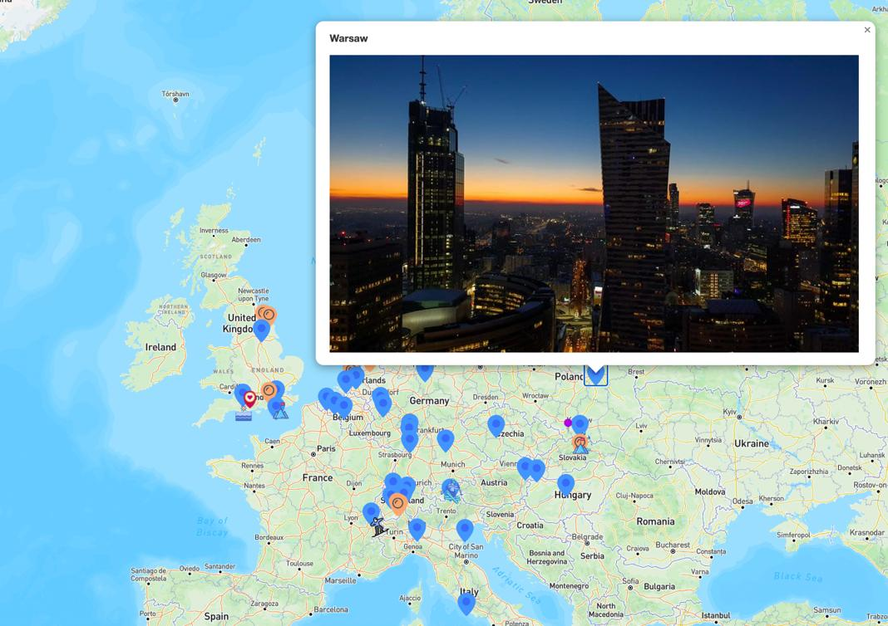

<h1 align="center">PopUp Cities I Went</h1>

## Short Description
To better visualize which city or attraction I have ever been, I create this simple web application. The markers are able to distinguish the categories of the places. Also, Clicking on the marker will PopUp the photo I take at that specific place. Any suggestion for this application would be appreciated. :)

## ScreenShot

    
    Demo Look.

Directory Structure Overview
---------------
Main files of this reposisory is structured as follows:

    PopUp-Cities-I-Went
     .
     |
     |--- images/         
     |      |
     |      |
     |      |--- marker/    Includes marker icons images on maps
     |      |
     |      |--- cities/    For the main cities' images I've been    
     |		|
     |		|--- towns/     The same one for towns
     |
     |
     |--- js/
     |	|
     |	|-- map.js/         Main info could be exited here, including lat and lon
     |
     |
     |--- css/
     |
     |--- index.html        This html is just a simple div for map